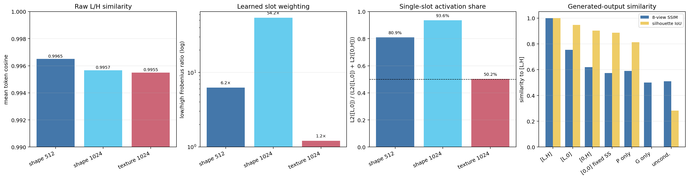
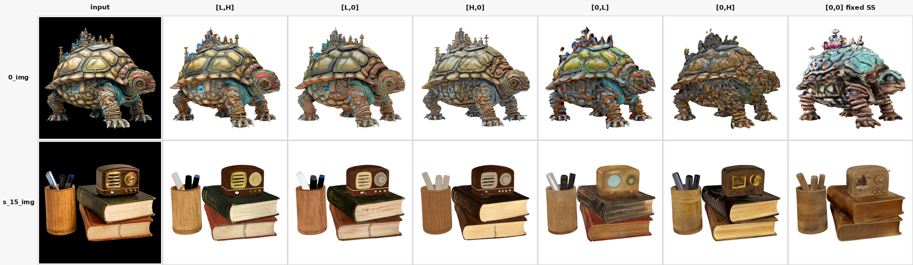
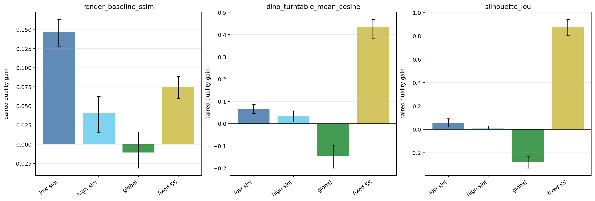
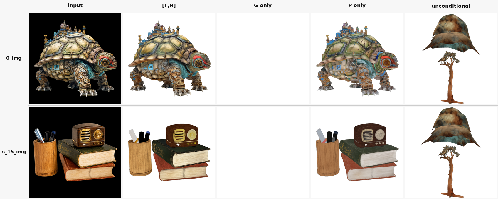
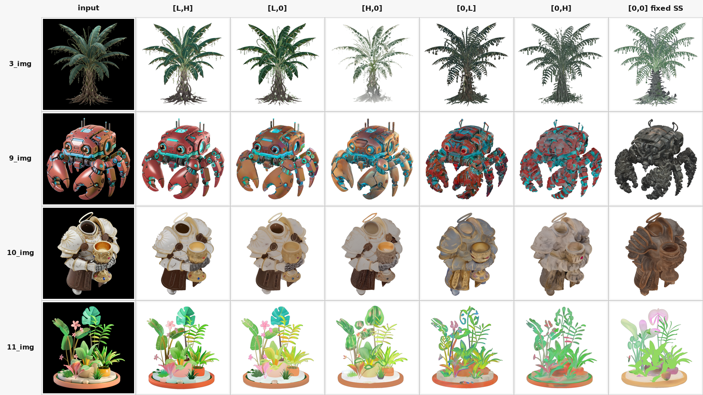
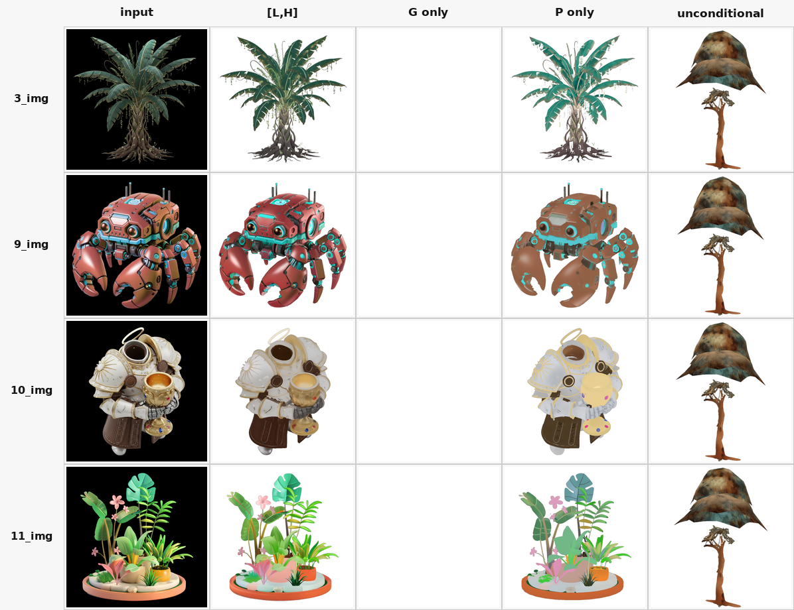

# Pixal3D low/high projection conditioning 인과 절제 실험 보고서

실험일: 2026-07-28

모델: `TencentARC/Pixal3D`

표본: 이미지 6장 × 조건 9개 × seed 42 = 54회

## 결론

`low_only=[L,0]`가 `high_only=[0,H]`보다 원본 `[L,H]` 결과에 가까운 주된
이유는 L이 본질적으로 semantic이고 H가 본질적으로 detail이어서가 아니다.
현재 checkpoint가 concat의 앞 절반을 shape 생성의 주 경로로, 뒤 절반을 특히
texture 보완 경로로 학습했기 때문이다.

원시 L/H token은 stage별 평균 cosine이 0.9955–0.9965로 거의 같다. 그럼에도
shape-512와 shape-1024의 projection weight low/high Frobenius 비는 각각
6.25배와 54.19배다. 실제 pretrained block을 통과한 단일-slot activation에서
low slot의 비중도 각각 80.9%, 93.6%다. 반면 texture-1024는 weight 비가
1.20배, activation 비중이 50.2%로 두 slot을 거의 균등하게 쓴다.

따라서 `low_only`는 dominant shape route를 보존해 geometry와 semantics를
상당히 유지하지만, texture stage의 절반가량을 제거하므로 appearance fidelity는
분명히 낮아진다. `high_only`는 H의 내용만 남기는 동시에 그것을 checkpoint가
shape에 약하게 쓰도록 학습한 high slot에 놓기 때문에 변화가 더 크다.

### 결과를 한 장으로 읽기



*그림 1. 왼쪽부터 원시 L/H feature의 cosine, projection weight의 low/high 비,
단일-slot activation 중 low slot의 비중, concat 결과와의 생성 유사도다.*

이 그림은 이번 실험의 핵심 인과 사슬을 보여준다.

1. **원시 feature는 거의 같다.** 첫 패널의 cosine은 모든 stage에서 0.995 이상이다.
2. **하지만 같은 위치에 투입되지 않는다.** 두 번째 패널에서 shape-1024의
   low/high weight 비는 54.2배까지 벌어진다.
3. **실제 block 출력도 shape에서 low slot이 지배한다.** 세 번째 패널의
   shape-512와 shape-1024 low-slot 비중은 80.9%, 93.6%다. Texture는 50.2%다.
4. **그래서 low-only가 더 비슷하다.** 마지막 패널에서 `[L,0]`은 `[0,H]`보다
   8-view SSIM과 silhouette IoU 모두 concat에 가깝다.

즉 첫 패널만 보면 L/H가 교환 가능해 보이지만, 두 번째와 세 번째 패널을 거치며
checkpoint가 두 concat 위치에 전혀 다른 역할을 부여했다는 사실이 드러난다.

## 모델 구조와 condition 경로

### DINO CLS/register token 사용 여부

사용한다. DINOv3 출력은 다음처럼 분리된다.

- global condition: CLS 1개 + register token 4개, 총 5개
- spatial condition L: native-resolution patch token field를 3D 위치에 back-project
- spatial condition H: 같은 patch field를 NAF로 upsample한 뒤 동일한 3D 위치에
  back-project

H는 별도 high-resolution DINO encoder에서 얻은 독립 정보가 아니다. L에서
출발해 RGB guide를 사용하는 NAF가 보간·변환한 field다.

### Global attention

각 denoising block에서 3D latent query `x`가 5개의 global token에
cross-attention한다. 개념적으로 다음 항을 만든다.

```text
global_out = CrossAttention(x, [CLS, REG1, REG2, REG3, REG4])
```

이 항은 개체 전체의 문맥을 제공하지만 3D 위치별로 직접 정렬된 image feature는
아니다.

### Back projection

카메라 파라미터를 이용해 3D grid 또는 sparse coordinate가 영상의 어느 위치에
대응하는지 구하고, 그 위치의 2D DINO/NAF feature를 sampling한다. 즉
back projection은 attention layer라기보다 2D feature를 3D token에
view-aligned하게 붙이는 기하학적 sampling 단계다.

Sparse-structure stage는 native DINO projection을 사용한다. 이후
shape-512, shape-1024, texture-1024 stage는 2048차원 `[L,H]`를 받는다.

### Projection attention

각 block은 독립적인 linear projection을 가진다.

```text
proj_out = W_proj [L,H] + b
block condition = global_out + proj_out
```

`W_proj`의 앞 1024개 column과 뒤 1024개 column은 서로 다른 parameter다.
따라서 동일한 vector를 앞 slot에 넣는 것과 뒤 slot에 넣는 것은 다른 함수다.
이번 실험의 `[H,0]`과 `[0,L]` 조건은 이 slot 효과를 content 효과에서
분리하기 위해 필요하다.

## 실험 설계

| 조건 | global | sparse projection | 이후 `[low slot, high slot]` | 질문 |
| --- | --- | --- | --- | --- |
| concat | on | L | `[L,H]` | 공개 모델 기준선 |
| low only | on | L | `[L,0]` | L만 보존 |
| H in low slot | on | L | `[H,0]` | low slot의 H |
| L in high slot | on | L | `[0,L]` | high slot의 L |
| high only | on | L | `[0,H]` | H만 보존 |
| zero both, fixed SS | on | L | `[0,0]` | sparse 구조 고정 후 이후 feature 제거 |
| global only E2E | on | zero | `[0,0]` | global 경로만 end-to-end |
| projection only E2E | zero | L | `[L,H]` | spatial projection만 end-to-end |
| unconditional E2E | zero | zero | `[0,0]` | image condition 전체 제거 |

모든 비교는 같은 이미지와 seed를 짝지었다. slot/content contrast의 95% 구간은
이미지 단위 paired bootstrap 10,000회로 계산했다. 3D ground truth가 없으므로
Chamfer와 normal consistency는 정답 품질이 아니라 concat 결과로부터의 변화량이다.

## 정량 결과

| 조건 | 입력 silhouette IoU | 입력 SSIM | 입력 LPIPS ↓ | concat 대비 8-view SSIM | concat 대비 Chamfer ↓ | normal consistency | DINO turntable mean |
| --- | ---: | ---: | ---: | ---: | ---: | ---: | ---: |
| `[L,H]` | 0.9441 | 0.6674 | 0.1863 | 1.0000 | 0.00000 | 1.0000 | 0.8450 |
| `[L,0]` | 0.9396 | 0.6221 | 0.2150 | 0.7529 | 0.00676 | 0.8262 | 0.8365 |
| `[H,0]` | 0.8967 | 0.5491 | 0.2809 | 0.6608 | 0.00755 | 0.8069 | 0.8139 |
| `[0,L]` | 0.8869 | 0.5186 | 0.3247 | 0.6063 | 0.00797 | 0.7751 | 0.7724 |
| `[0,H]` | 0.8885 | 0.5262 | 0.3355 | 0.6201 | 0.00794 | 0.7705 | 0.7812 |
| `[0,0]`, fixed SS | 0.8754 | 0.4780 | 0.3756 | 0.5739 | 0.00827 | 0.7559 | 0.7489 |
| global only | 0.0000 | 0.4499 | 0.5263 | 0.4994 | n/a | n/a | 0.3153 |
| projection only | 0.9374 | 0.6078 | 0.2456 | 0.5902 | 0.02771 | 0.6941 | 0.8252 |
| unconditional | 0.2833 | 0.4615 | 0.4951 | 0.5101 | 0.09459 | 0.5132 | 0.4599 |

`low_only`의 concat 대비 8-view SSIM이 `high_only`보다 높은 현상은 6개 이미지
모두에서 관측됐다. 평균은 0.7529 대 0.6201이다.

### 대표 qualitative 비교



*그림 2. 두 대표 입력의 conditioning-view 결과. 열은 input, concat,
`[L,0]`, `[H,0]`, `[0,L]`, `[0,H]`, sparse structure를 고정한 `[0,0]`
순서다.*

그림 2는 다음 순서로 읽으면 된다.

- **단순 low/high 비교:** `[L,0]` 대 `[0,H]`를 보면 low-only가 원본의 정체성,
  silhouette, 색을 훨씬 많이 보존한다.
- **같은 H content의 slot 비교:** `[H,0]` 대 `[0,H]`를 보면 H도 low slot에
  놓았을 때 concat에 더 가까워진다. 즉 차이 일부는 resolution이 아니라 slot이다.
- **같은 L content의 slot 비교:** `[L,0]` 대 `[0,L]`에서는 content가 같아도
  high slot으로 이동하는 순간 형태와 재질이 크게 바뀐다.
- **projection 제거의 위치:** `[0,0] fixed SS`도 물체 category는 유지한다.
  sparse stage에서 projection으로 occupancy를 먼저 확보했기 때문이다.

### 시각적 전수 검사

12개 contact sheet와 6개 conditioning-difference panel을 모두 확인했다.

- 6개 이미지 모두에서 low-only가 high-only보다 concat의 정체성, 색, turntable
  형상을 더 잘 보존했다. 정량 순서를 뒤집는 이미지별 예외는 없었다.
- global-only는 모든 view와 이미지에서 blank였다. 이는 흰 배경 때문에 SSIM이
  약 0.5로 보이는 수치상의 착시와 달리 실제 foreground가 0임을 확인한다.
- projection-only는 여섯 category를 모두 유지했다. 다만 concat 대비 8-view
  SSIM이 0.5902인 점처럼 unseen-view 형상과 appearance에는 눈에 띄는 이동이 있다.
- unconditional은 입력 category와 무관하게 여섯 이미지 모두에서 유사한
  우산/나무 형태 prior로 수렴했다.
- fixed-SS `[0,0]`는 category와 occupancy를 유지하지만 turtle의 청록색 재질,
  crab의 어두운 무채색화, coffee-object의 거친 표면처럼 texture와 세부 형상이
  이미지별로 다르게 이동했다.

### Slot과 content의 분리

quality가 높을수록 좋은 방향으로 부호를 통일한 paired contrast는 다음과 같다.

| Contrast | 8-view SSIM gain | 95% bootstrap CI |
| --- | ---: | ---: |
| low-slot 효과: `[L,0] - [0,L]` | +0.1466 | [0.1282, 0.1629] |
| high-slot 효과: `[H,0] - [0,H]` | +0.0408 | [0.0156, 0.0626] |
| low-slot 내 content 효과: `[L,0] - [H,0]` | +0.0921 | [0.0579, 0.1309] |
| high-slot 내 content 효과: `[0,L] - [0,H]` | -0.0138 | [-0.0314, -0.0002] |



*그림 3. 막대가 0보다 높으면 앞의 조건이 더 좋은 방향이라는 뜻이며, 오차 막대는
6개 이미지를 단위로 한 paired bootstrap 95% 구간이다. `low slot`은
`[L,0]-[0,L]`, `high slot`은 `[H,0]-[0,H]`, `global`은
global-only−unconditional, `fixed SS`는 fixed-SS−global-only다.*

첫 번째 패널에서 low-slot gain은 +0.1466으로 high-slot gain +0.0408보다 크다.
DINO와 silhouette에서도 같은 방향이다. 반면 global-only gain은 DINO와
silhouette에서 음수다. 이는 정상 concat 모델에서 global token이 해롭다는 뜻이
아니라, projection을 0으로 만든 OOD 조건에서 global token만으로는 sparse
occupancy와 image identity를 복원하지 못했다는 뜻이다.

L과 H를 같은 low slot에서 비교해도 L이 더 가깝기 때문에 content 차이가 전혀
없는 것은 아니다. 그러나 `[L,0]` 대 `[0,H]` 차이를 순수 resolution 효과로
부를 수는 없다. 가장 큰 항이 slot routing과 얽혀 있기 때문이다. high slot
내에서는 L/H content 차이가 매우 작고 방향도 반대다.

## Global/projection factorial 해석

global-only는 6개 이미지 모두 sparse occupancy가 0이어서 빈 결과가 됐다.
반면 projection-only는 입력 silhouette IoU 0.9374와 DINO mean 0.8252를
유지했다. concat의 0.9441, 0.8450에 매우 가깝다.



*그림 4. 동일 입력에서 global과 spatial projection을 end-to-end로 켜고 끈 결과.
`G only`의 흰 칸은 rendering 오류가 아니라 실제 occupied sparse voxel이 0인
결과다.*

두 입력 모두 `P only`는 category와 주요 silhouette를 보존하지만 `G only`는
foreground를 만들지 못한다. `unconditional`은 입력과 관계없이 같은
우산/나무형 prior로 수렴한다. 따라서 `G only`의 약 0.5 SSIM은 물체 보존이 아니라
흰 배경끼리 일치해 생기는 수치상의 착시다.

이 결과를 “global token이 쓸모없다”로 해석하면 안 된다. projection을 완전히
0으로 만드는 것은 학습 분포 밖의 개입이고, denoising cascade와 CFG는
비선형이므로 독립 효과를 단순 가산할 수 없다. 안전한 결론은 다음 두 가지다.

1. spatial projection은 이 checkpoint에서 독립적으로 복원 가능한 image-specific
   signal의 대부분을 운반한다.
2. global condition은 독립적으로 충분한 semantic pathway가 아니며, 정상 모델에서의
   효과는 projection이 존재할 때의 조건부 상호작용으로 평가해야 한다.

global-only가 unconditional보다 DINO similarity와 silhouette IoU에서 더 낮고
occupancy까지 0인 것은 global context가 projection 없는 prior와 충돌했을 가능성을
보여준다. 다만 이는 inference-time OOD 현상이므로 정상 concat 경로에서 global
token이 해롭다는 증거는 아니다.

`[0,0] fixed SS`는 global-only와 달리 인식 가능한 물체를 생성했다. sparse
structure를 정상 projection으로 먼저 만든 후 이후 shape/texture projection만
지웠기 때문이다. 따라서 global-only의 blank 결과는 주로 sparse-stage occupancy
gating 붕괴를 진단하며, 이후 decoder가 projection 없이 전혀 작동할 수 없다는
뜻은 아니다.

## 연구적 의미

1. **Resolution ablation에는 slot-swap control이 필요하다.** concat checkpoint에서
   `[L,0]`과 `[0,H]`만 비교하면 feature content와 learned column routing을 동시에
   바꾼다. `[H,0]`, `[0,L]`이 없으면 “low가 semantic, high가 detail” 같은 결론은
   식별되지 않는다.
2. **NAF H는 새 semantic source라기보다 refinement다.** H는 독립 encoder가
   아니고 L에서 파생되며 raw cosine도 0.995 이상이다. 차이는 작은 feature 변화와
   slot-specific transform의 결합에서 증폭된다.
3. **Shape와 texture의 conditioning 사용 방식이 다르다.** shape stage는 low
   slot에 매우 강하게 치우치고 texture stage는 두 slot을 균형 있게 사용한다.
   그러므로 low-only가 semantic뿐 아니라 geometry까지 유지하고, 주된 손실이
   appearance 쪽에 나타나는 것이 자연스럽다.
4. **Projection 경로가 예상보다 많은 semantics를 운반한다.** global token을
   제거해도 projection-only의 DINO mean이 0.8252로 concat 0.8450에 가깝다.
   “global=semantic, projection=detail”이라는 이분법은 이 모델에 맞지 않는다.
5. **Branch capacity와 checkpoint preference는 다르다.** 이번 결과는 `[L,H]`로
   학습된 checkpoint의 사용 선호를 보여준다. low-only 또는 high-only branch의
   잠재 capacity를 비교하려면 동일 budget으로 각각 재학습해야 한다.

## 권장 후속 실험

- seed를 3–5개로 늘려 현재 mechanism이 sampling noise에 안정적인지 확인한다.
- 학습 시 L/H independent dropout을 적용해 각 branch의 조건부 기여도를 식별한다.
- slot permutation 또는 shared projection/gating을 사용해 content와 position을
  분리한다.
- low-only와 high-only를 동일 compute로 재학습해 branch capacity를 비교한다.
- 독립 high-resolution DINO encoder를 사용해 “NAF refinement”와 “새
  high-resolution 정보”를 구분한다.
- ground-truth 3D가 있는 표본에서 geometry accuracy를 별도로 측정한다.

## 시각 부록: 나머지 네 표본



*그림 5. Palm, crab, coffee-object, plant에서도 대표 표본과 같은 열 순서를
사용했다. 모든 이미지에서 `[L,0]`이 `[0,H]`보다 concat의 category와 appearance를
더 많이 유지한다.*



*그림 6. 나머지 네 이미지에서도 `G only`는 모두 blank이고 `P only`는 입력
category를 보존하며 unconditional은 동일한 우산/나무 prior로 수렴한다.*

대표 두 표본과 부록 네 표본을 합치면 총 6개 전체 실험 이미지가 문서 안에
포함된다. Turntable 전체 view와 pixel-difference panel은 아래 원본 산출물 링크에서
추가로 확인할 수 있다.

## 시각화와 산출물

- [체크인된 보고서 그림 디렉터리](assets/projection-conditioning-causal-ablation)
- [원본 통합 메커니즘 요약](../../outputs/projection_feature_ablation/causal_seed42/figures/mechanism_summary.png)
- [projection weight norm](../../outputs/projection_feature_ablation/causal_seed42/figures/projection_weight_norms.png)
- [pretrained-block activation](../../outputs/projection_feature_ablation/causal_seed42/figures/projection_contributions.png)
- [paired causal contrast](../../outputs/projection_feature_ablation/causal_seed42/figures/causal_findings.png)
- [전체 정량 CSV](../../outputs/projection_feature_ablation/causal_seed42/summary.csv)
- [machine-readable summary](../../outputs/projection_feature_ablation/causal_seed42/summary.json)
- [자동 생성 영문 보고서](../../outputs/projection_feature_ablation/causal_seed42/report.md)

이미지별 9-condition difference panel은 `figures/`, turntable contact sheet는
`contact_sheets/`에 있다.

## 한계와 재현성 주의

- 6개 표본, 1개 seed이므로 benchmark나 모집단 추정이 아니라 mechanism study다.
- DINO metric은 모델 내부 representation과 독립적이지 않다.
- 입력 view fidelity는 보이지 않는 후면 geometry의 정확성을 보장하지 않는다.
- global/projection zeroing은 모두 inference-time OOD intervention이다.
- global-only의 surface metric은 빈 mesh에 임의의 finite distance를 부여하지 않고
  `n/a`로 censor했다.
- 2개 run은 CuMesh OOM 뒤 geometry-only CPU GLB fallback을 사용했다. generation과
  render는 동일하지만 해당 GLB에는 texture가 없다.
